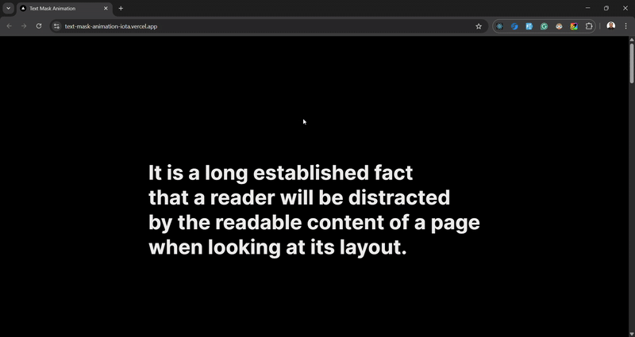

## Text Mask Animation

An animation featuring a text sliding effect with a mask, to give the effect of text gradually appearing when in view. Made with Next.js and Motion (prev. Framer Motion).



### Usage

### Clone the Repository

```bash
git clone https://github.com/arvinbuid/text-mask-animation.git
```

#### Install npm dependencies

```bash
npm install
```

### Run in development mode

```bash
npm run dev
```

Open [http://localhost:3000](http://localhost:3000) with your browser to see the result.
